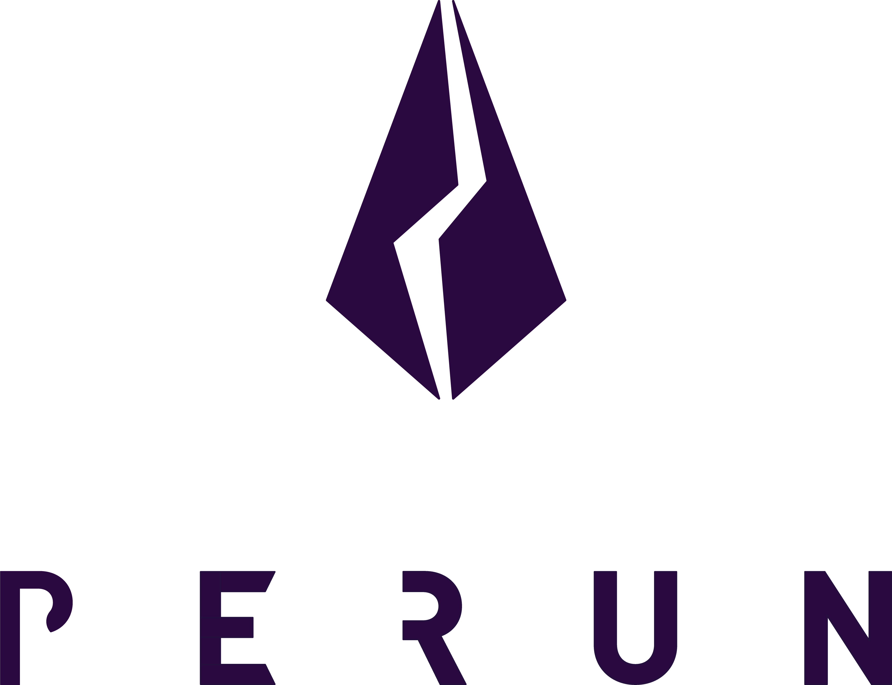

<h1 align="center">
    <a href="https://perun.network/"></a>
</h1>


# [Perun](https://perun.network/) ICP backend

This repository contains the [Dfinity Internet Computer](https://dfinity.org/) backend for the [go-perun](https://github.com/perun-network/go-perun) channel library. It provides the necessary components to run our secure peer-to-peer Perun Payment Channels on the Dfinity blockchain. The payment channel implementation connects our Perun state machine with the [Perun canister](https://github.com/perun-network/perun-icp-canister), which implements the Perun Payment Channel logic on the Internet Computer. This project is financed through the DFINITY grants program.

In the following sections, we will describe how to run Payment Channels on a local instance of the Dfinity Internet Computer.


## [Installation](#installation)

1. Install [dfx](https://internetcomputer.org/docs/current/references/cli-reference/dfx-parent), the DFINITY command-line execution environment:
```sh
sh -ci "$(curl -fsSL https://smartcontracts.org/install.sh)"
```

2. Clone this repository
```sh
git clone https://github.com/perun-network/perun-icp-backend
cd perun-icp-backend
```

3. Generate dfx accounts

To generate new seed phrases from scratch, we use [keysmith](https://github.com/dfinity/keysmith):

```sh
keysmith generate
keysmith private-key
```

This generates an ```identity.pem``` file containing the private key to govern an identity on the Internet Computer. We import it into dfx using the ```dfx identity import``` function of dfx:

```sh
dfx identity import IDENTITYNAME identity.pem
```

This will store the pem file in ```~/.config/dfx/identity/IDENTITYNAME/identity.pem```.

NOTE: For quick testing purposes, we have already included .pem files for the ```minter```, ```usera``` and ```userb``` identities in the ```./userdata/identities``` directory. For running the demo and tests, you can import them into dfx using the following commands:

```sh
dfx identity import minter identity.pem
dfx identity import usera identity.pem
dfx identity import userb identity.pem
```

Verify that the identities have been imported, using ```dfx identity list``` and also checking ```~/.config/dfx/identity/IDENTITYNAME/identity.pem```.

## [Run the dfx blockchain](#run~the~dfx~blockchain)

After installation, to use the backend, you first need to instantiate a local dfx replica and deploy the ledger Perun canister. The script ```deploycans.sh``` does this for you:

```sh
cd perun-icp-backend
./deploycans.sh
```

This will start a local Internet Computer blockchain and deploy both canisters necessary for Perun: the Ledger canister for processing transactions, and the Perun canister governing the Payment Channel logic. It will also mint ```ICP``` into the accounts you have imported into dfx. 

Note that by default, the ```deploycans.sh``` script uses the provided ```minter```, ```usera``` and ```userb``` identities:

```sh
createLedgerArg() {
    local ICP_PERUN_MINT_ACC="433bd8e9dd65bdfb34259667578e749136f3e0ea1566e10af1e0dd324cbd9144"
    local ICP_PERUN_USERA_ACC="97520b79b03e38d3f6b38ce5026a813ccc9d1a3e830edb6df5970e6ca6ad84be"
    local ICP_PERUN_USERB_ACC="40fd2dc85bc7d264b31f1fa24081d7733d303b49b7df84e3d372338f460aa678"

    echo "(record {minting_account = \"$ICP_PERUN_MINT_ACC\"; initial_values = vec { record { \"$ICP_PERUN_USERA_ACC\"; record { e8s=10_000_000} }; record { \"$ICP_PERUN_USERB_ACC\"; record { e8s=10_000_000 } }}; send_whitelist = vec {}})"
}
```

This uses the minter account to mint ```10_000_000 ICP``` into the accounts ```usera``` and ```userb```.  The ```ICP_PERUN_MINT_ACC``` ```ICP_PERUN_USERA_ACC``` and ```ICP_PERUN_USERB_ACC``` are the account identifiers of the ```minter```, ```usera``` and ```userb``` identities respectively. You can verify these account identifies by running ```dfx ledger account-id``` for each of the identities. If you want to use other identities, you can simply change the ```ICP_PERUN_MINT_ACC```, ```ICP_PERUN_USERA_ACC``` and ```ICP_PERUN_USERB_ACC``` variables in the ```deploycans.sh``` script so that the ICP is minted into the accounts you want to use.

After successful initialization of the local blockchain, you can now run the demo and the tests. To stop the local blockchain, run the ```stop.sh``` script,

```sh
./stop.sh
```

## [Payment Channel Demo](#payment~channel~demo)

To run the Perun Payment Chanel Demo, [install](##installation) and [initialize](#run-the-dfx-blockchain) the local blockchain. Then, run the ```main.go``` file in the main directory:

```sh
cd perun-icp-backend
go run main.go
```

A basic overview of the functionality can be found in our [Perun Demo TUI](https://github.com/perun-network/perun-demo-tui) repository. 

## [Tests](#tests)

To test the main components of the Perun Internet Computer backend, perform the [installation](##installation), and [initialize](#run-the-dfx-blockchain) the local blockchain. Afterwards, run the tests with the following command:

```sh
cd perun-icp-backend
go test -v ./...
```

## Copyright

Copyright 2023 PolyCrypt GmbH. Use of the source code is governed by the Apache 2.0 license that can be found in the [LICENSE file](LICENSE).